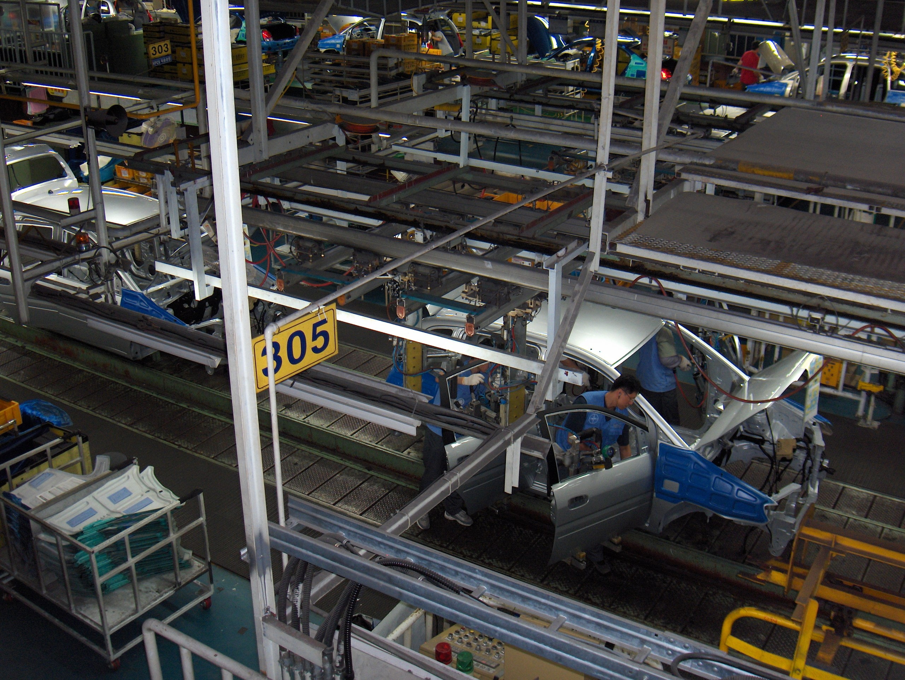
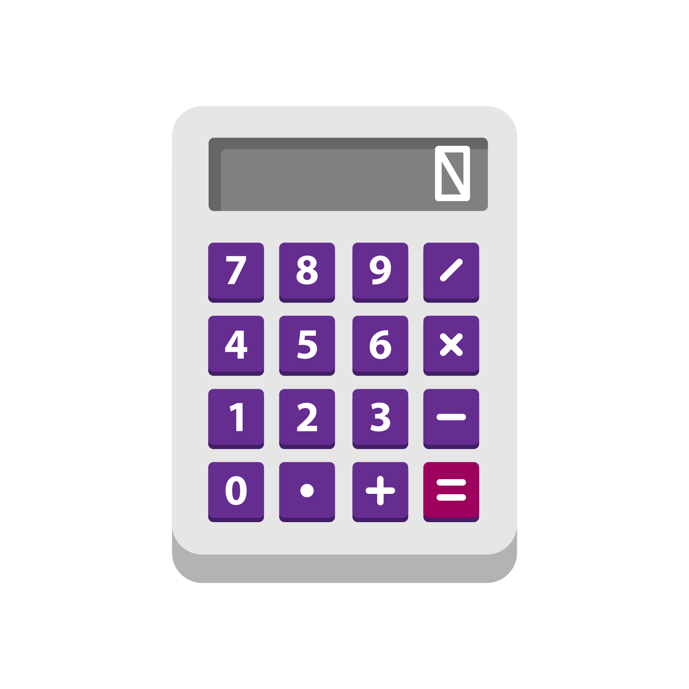

<!-- bbox: [22,9,643,10] -->
# AlphaCalc Technologies - 전자계산기 제조 기업 발표 자료

<!-- bbox: [22,24,98,7] -->
## 1. 기업 개요

<!-- bbox: [22,33,178,5] -->
**첨단 계산 기술로 미래를 설계하다**

<!-- bbox: [22,41,758,111] -->

Office workspace with calculator

<!-- bbox: [22,155,956,9] -->
AlphaCalc Technologies는 1998년 설립된 전자계산기 전문 제조 기업으로, 교육·사무·산업 용도의 다양한 계산 솔루션을 전 세계에 공급하고 있다. 우리는 단순한 계산을 넘어, **정확성·사용성·내구성**을 핵심 가치로 삼아 혁신을 추구한다.

<!-- bbox: [22,168,226,7] -->
## 2. 기술 기반 및 R&D 인프라

<!-- bbox: [22,177,200,5] -->
**정밀 전자기술 + 차세대 프로세서 개발**

<!-- bbox: [22,185,625,104] -->

PCB close-upTech electronics backgroundDigital tech light abstract

<!-- bbox: [22,292,956,9] -->
AlphaCalc의 핵심 경쟁력은 자체 개발한 **CalcEngine X2 프로세서**, 안정적인 **회로 설계 기술**, 고효율 전자 신호 처리 기술에 있다. R&D 센터는 전 세계 3개국에 구축되어 있으며, 초저전력 프로세서와 고내구성 키패드 기술을 지속적으로 개발하고 있다.

<!-- bbox: [22,305,221,7] -->
## 3. 생산 및 품질 관리 시스템

<!-- bbox: [22,315,213,5] -->
**최상의 제품은 최적화된 공정에서 나온다**

<!-- bbox: [22,322,956,174] -->

AlphaCalc는 ISO 9001 기반의 고도화된 생산 공정을 운영한다. 자동화 라인과 실시간 검사 시스템을 결합하여 모든 제품은 출고 전 7단계 품질 검사를 통과해야 한다.

<!-- bbox: [22,500,116,7] -->
## 4. 제품 라인업

<!-- bbox: [22,510,131,5] -->
**기능별, 용도별 특화 모델**

<!-- bbox: [22,518,224,6] -->
### 4.1 Basic Series – 일상 및 학습용

<!-- bbox: [22,526,956,229] -->

Office desk with calculator

<!-- bbox: [22,758,620,5] -->
Basic 시리즈는 직관적인 조작과 내구성을 중심으로 설계되었다. 가정, 교육 현장, 일반 사무실에서 가장 널리 사용된다.

<!-- bbox: [22,766,250,6] -->
### 4.2 Scientific Series – 공학·통계 전용

<!-- bbox: [22,774,352,62] -->

Digital abstract visualization

<!-- bbox: [22,839,503,5] -->
Scientific 시리즈는 최대 240개의 과학/공학 기능을 제공하며 정확한 통계 분석 기능을 포함한다.

<!-- bbox: [22,846,260,6] -->
### 4.3 Graph Series – 시각 기반 고급 모델

<!-- bbox: [22,855,625,104] -->

Graph illustration

<!-- bbox: [22,962,603,5] -->
Graph 시리즈는 컬러 LCD, 그래프 표현, 데이터 저장, 사용자 프로그램 기능을 지원하는 전문가용 계산기 모델이다.

<!-- bbox: [22,970,219,7] -->
## 5. 결론: AlphaCalc의 비전

<!-- bbox: [22,980,228,5] -->
**정확성·지속성·확장성의 미래형 계산 솔루션**

<!-- bbox: [22,987,805,5] -->
AlphaCalc는 계산기의 본질적 가치를 재정의하며 교육·산업·연구의 모든 영역에 사용할 수 있는 **길고, 정확하고, 신뢰할 수 있는 계산 솔루션**을 제공하겠다.
