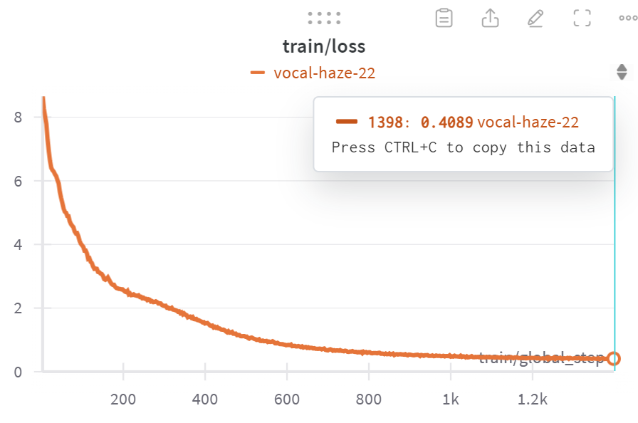

<!-- bbox: [21,10,337,12] -->
# LLM 한국어-영어 통합 방법 실험

<!-- bbox: [21,26,35,8] -->
## 목표

<!-- bbox: [21,37,515,5] -->
Llama 모델의 vocab expansion 버전을 한국어와 영어가 같은 semantic space에서 표현되도록 변경

<!-- bbox: [21,45,303,15] -->
- 영어와 같은 의미의 한글 입력에 대해 동일한 출력 생성
- 한글에서도 영어 benchmark와 비슷한 성능 달성
- Parallel dataset - stage 1에서 활용

<!-- bbox: [21,64,420,60] -->
<table>
<thead>
<tr>
<th>데이터셋</th>
<th>설명</th>
<th>Train</th>
<th>Validation</th>
</tr>
</thead>
<tbody>
<tr>
<td>AIhubK2EBroadcast</td>
<td>방송콘텐츠 번역 말뭉치</td>
<td>521,651</td>
<td>65,431</td>
</tr>
<tr>
<td>AIhubK2ECorpus</td>
<td>병렬 번역 말뭉치</td>
<td>1,602,418</td>
<td>-</td>
</tr>
<tr>
<td>AIhubK2ESciTech</td>
<td>전문분야 한영 말뭉치</td>
<td>1,195,228</td>
<td>149,403</td>
</tr>
<tr>
<td>AIhubK2ESoSci</td>
<td>기술과학 번역 말뭉치</td>
<td>1,210,529</td>
<td>151,316</td>
</tr>
<tr>
<td>AIhubK2EExpert</td>
<td>사회과학 번역 말뭉치</td>
<td>1,200,000</td>
<td>150,000</td>
</tr>
<tr>
<td><strong>Total</strong></td>
<td></td>
<td><strong>5,729,826</strong></td>
<td><strong>516,150</strong></td>
</tr>
</tbody>
</table>

<!-- bbox: [21,127,95,8] -->
## 평가 metric

<!-- bbox: [21,138,556,20] -->
- 영어 원본이 한글로 번역된 데이터 (arc_challenge → ko_arc_challenge)
- 정확히 1:1 대응되는 데이터 셋으로 영어 지식이 한글로 trasfer되었는지 살펴보기 좋은 데이터 셋
- 위 평가 task에서 각 example 의 output으로 같은 응답을 출력하는지, 같은 응답을 출력하는 응답의 비율
- kollm_evaluation을 활용

<!-- bbox: [21,163,86,8] -->
## Baselines

<!-- bbox: [21,174,493,10] -->
- **princeton-nlp/Sheared-LLaMA-1.3B-ShareGPT**: 실험 중인 모델의 base 모델 (대조군)
- **EleutherAI/polyglot-ko-1.3b:** 한국어를 잘하는 1.3B 모델

<!-- bbox: [21,188,53,8] -->
## 실험들

<!-- bbox: [21,199,978,286] -->
- Stage1) contrastive learning to train embedding layer and all of the transformer layers for integrating Korean and English   validation set의 한국어 representation과 영어 representation 사이의 cosine similarity
- Stage2) training LM head with freezing the other layers and Korean data. 
- 데이터에 영어와 한국어서 섞여서 그런지 시작하는 loss가 Stage2)의 것보다 좀 높다
- 3번째 stage인 full finetuning이 끝난 모델
- 각 test case마다 영어-한글 번역 쌍이 존재하는 task를 선정하여 모델의 성능을 비교한다. 실험하는 방법이 좋은 방법이라면 영어 score가 한국어 version task에 비슷하게 나와야 할 것이다.
- 학습이 800step 정도 진행된 결과 (0.04 epoch정도, 11시간 정도 학습) 결과가 좋지 않은 것 같다. 한국어로 expansion한 tokenzier를 사용함에도 불구하고, 기존 base model의 한국어 성능과 비슷하게 나오나, 영어 benchmark에서는 기존의 능력을 잃어버린 것으로 보인다. 현재로써는 학습이 진행되면서 기존의 영어 능력이 회복될 수 있을지 알기 어려우므로 좀 더 지켜보는 것이 필요할 것으로 보인다.
- 학습이 진행되니 1600 step에서 정점을 찍었다가 떨어지는 양상이라서 학습을 멈춤
- 영어 입력을 받은 모델을 freezing한 결과, evaluation하는 단계에서 freezing한 모델을 통과한 영어 문장의 representation과 tuning하고 있는 모델을 통과한 대응되는 한글 문장의 representation간의 cosine similarity는 0.35 정도로 떨어짐이 확인됨 (freezing하지 않고 같은 실험을 했을때는 0.6)정도의 수치임.
- freeze되어 한 모델로 encoding되는 영어 semantic space와 tuning되고 있는 한글 semantic space가 다를 것이므로, cosine similarty가 두 문장간의 거리를 정확히 측정했다고 보기는 힘들 것으로 보임.
- 그 보다는 학습 이전의 모델이 형성하던 semantic space 상의 병렬 코퍼스 상의 영어와 한글 문장간의 평균 거리와 학습 이후의 형성된던 semantic space 상의 병렬 코퍼스 상의 영어와 한글 문장간의 평균 거리의 차를 보는 게 더 맞을 것으로 판단됨.
- 해당 실험의 결과가 최종 결과에 확신할 수 없으므로, 최종 단계까지 가서 확인을 해야 할 것으로 보임. 
- 한국어 위키피디아(807M), 한국어 웹데이터 (15G),
- 영어 위키피디아 (20.28 GB)
- AIHub에서 구한 번역 데이터 (1.5GB)
- constrastive learning을 위한 generation을 위한 data가 다르므로, 그 사이즈도 다르다. 따라서, 학습을 위한 batch들을 구성할 때 작은 쪽 데이터가 떨어졌을 경우, 다시 반복되는 식으로 batch를 구성한다.
- 같은 embedder를 사용하는 효과가 있어, cosine similarity를 잴 때 같은 공간내에서 측정하게 되어 좀 더 정확한 유사도를 측정할 수 있을 것 같다.
- 1 epoch 학습에 소요 시간(예측) : 186 시간
- Motivation - InfoXLM 논문([2007.07834 (arxiv.org)](https://arxiv.org/pdf/2007.07834) )에 따르면, 마지막 layer로 constrastive learning을 하는 objective와 generation objective가 상충되는 방향에 있다는 얘기를 한다. InfoXLM 에서 학습된 모델의 중간 layer의 representation으로 검색을 하면, 아래 그림과 같이 마지막 layer 보다, 5~11 번째 layer를 사용했을 때 검색 정확도가 더 높다. 이 결과는 중간 layer가 문장의 의미를 더 잘 담고 있다고 해석할 수 있다.
- Motivation - Decoder only LLM의 모델도 비슷한 양상, 즉 중간 layer의 어디에선가 문장 단위의 representation이 일어날 수 있을 것이라 유추해 볼 수 있다. 하지만 정확한 layer에서의 위치는 실험 해보지 않으면 알기 어려울 것이다.
- idea - 만약 decoder only LLM도 위 그림과 같은 양상을 띈다면 중간 layer들을 여러 개 활용하고 각 layer를 활용하는 정도(weight)를 최적화 할 수 있다면 실험 없이도 적절한 representation을 뽑아 낼 수 있을 것이다.
- 중간 layer 중 일부(이것은 hyper parameter로 지정) 에 대해서 만, 각 layer 별 weight를 trainable parameter로 지정
- softmax를 각 layer 별 weight에 적용하여, weight의 합이 1이 되도록 함.
- weight를 각 layer 별 representation으로 만든 vector에 곱한 후 합해서 하나의 vector로 만듦.
- 학습이 진행되면서, weight들이 변동하는 것으로 보아, weight에 대한 학습이 일어나는 것으로 보임.
- 밑에서 15번째 중간 layer의 weight를 가장 중시 여기는 것으로 보인다. - [InfoXLM 분석 결과](LLM%20%ED%95%9C%EA%B5%AD%EC%96%B4-%EC%98%81%EC%96%B4%20%ED%86%B5%ED%95%A9%20%EB%B0%A9%EB%B2%95%20%EC%8B%A4%ED%97%98%20772dbaccf55d4fe29121d89d7a7dc05a.md)와 같은 맥락으로 보임.
- 상위 layer에서 weight 값이 크다. - [InfoXLM 분석 결과](LLM%20%ED%95%9C%EA%B5%AD%EC%96%B4-%EC%98%81%EC%96%B4%20%ED%86%B5%ED%95%A9%20%EB%B0%A9%EB%B2%95%20%EC%8B%A4%ED%97%98%20772dbaccf55d4fe29121d89d7a7dc05a.md)와 같은 맥락으로 보임.
- 초기layer(1, 2) layer가 특이하게 weight 값이 크다 - Align after pretrain 의 분석 결과와 일치하는 것으로 보임.
- 실험 2와 거의 비슷한 arc_challenge 성능과 일치도를 보인다. 이 실험에서는 weight를 줌에 따라 성능의 향상을 보긴 어려웠다. 아무래도 layer별 representation의 weight외에 영어를 받아들이는 모델을 freezing함에 따라 한글 성능이 향상되는데 한계가 있는 것으로 추측된다.
- Motivation: 실험 0에서 contrastive learning만 활용하는 경우 일치도가 매우 증가하는 반면, 실험2~3와 같이 generation을 constrastive learning을 함께 하는 경우 일치도가 감소하고, 성능 향상되는 것으로 보이는데, 일치도를 더 향상 시켜야, 한글과 영어 지식을 공유하는 모델이 될 것이다. 따라서, contrastive learning을 강화하는 방법이 필요하다. **실험 2~3에서 영어를 받아들이는 모델을 freezing했던 것을 풀어 놓는다면 좀 더 contrastive learning하는 데 도움이 될 것으로 보인다.**
- 실험 0과 같이 cl_loss가 좀 더 잘 떨어지는 동시에 cosine similarity가 유지되는 특성을 보임.  northern-forest-55(실험3) 대비 balmy-capybara-59(실험4)의 cosine similarity가 더 유지가 잘된다. 
- 또한, 실험 2~3에서 그랬던 것 처럼 generation loss도 감소하는 특성을 보임.
- layer 별 weights - 17번째 layer의 output이 가장 큼 
- 일치도가 약간 개선 될 수 있으나. (2400 step), 실험 0에서와 같이 일치도가 많이 향상 되는 결과를 볼 수 없었음. generation loss를 추가하면, contrastive learning의 효과가 많이 반감되는 것으로 판단됨.
- contrastive learning을 빼고 한국어/영어를 학습했을 때와의 성능 비교 필요
- 이게 만약 효과가 있다면, 현재 학습된 layer별 weight간의 격차를 높이도록 하는 것이 효과가 있을 것이라 생각한다. (현재는 weight 간의 격차가 0.0025 정도로 너무 낮은 상태라 생각됨.)

<!-- bbox: [21,489,75,8] -->
## 분석 결과

<!-- bbox: [21,500,188,5] -->
#### Layer 1 (Run-royal-mountain-65)

<!-- bbox: [21,508,934,131] -->

<table> <thead> <tr> <th>Model</th> <th>ko_arc_challenge</th> <th>arc_challenge</th> </tr> </thead> <tbody> <tr> <td>Base</td> <td>0.2560</td> <td>0.2816</td> </tr> <tr> <td>checkpoint-200</td> <td>0.2560</td> <td>0.2935</td> </tr> <tr> <td>checkpoint-400</td> <td>0.2415</td> <td><strong>0.2961</strong></td> </tr> <tr> <td>checkpoint-600</td> <td>0.2398</td> <td>0.2944</td> </tr> <tr> <td>checkpoint-800</td> <td><strong>0.2611</strong></td> <td>0.2918</td> </tr> </tbody> </table>

<!-- bbox: [21,642,182,5] -->
#### Layer 17 (Run-frosty-durian-64)

<!-- bbox: [21,650,934,91] -->

<table><thead><tr><th>Model</th><th>ko_arc_challenge</th><th>arc_challenge</th></tr></thead><tbody><tr><td>Base</td><td>0.2560</td><td>0.2816</td></tr><tr><td>checkpoint-200</td><td>0.2543</td><td><strong>0.2969</strong></td></tr><tr><td>checkpoint-400</td><td><strong>0.2722</strong></td><td>0.2944</td></tr><tr><td>checkpoint-600</td><td>0.2517</td><td>0.2935</td></tr><tr><td>checkpoint-800</td><td>0.2491</td><td>0.2944</td></tr></tbody></table>

<!-- bbox: [21,745,179,6] -->
### 일치도 & Cosine Similarity

<!-- bbox: [21,754,445,51] -->
<table>
<thead>
<tr>
<th>Model</th>
<th>Layer 1 일치도</th>
<th>cos_sim</th>
<th>Layer 17 일치도</th>
<th>cos_sim</th>
</tr>
</thead>
<tbody>
<tr>
<td>Base</td>
<td>40.02</td>
<td>0.99</td>
<td>40.02</td>
<td>0.93</td>
</tr>
<tr>
<td>checkpoint-200</td>
<td>34.47</td>
<td>0.98</td>
<td>35.40</td>
<td>0.93</td>
</tr>
<tr>
<td>checkpoint-400</td>
<td>36.09</td>
<td>0.98</td>
<td>34.90</td>
<td>0.81</td>
</tr>
<tr>
<td>checkpoint-600</td>
<td><strong>36.26</strong></td>
<td>0.96</td>
<td><strong>35.49</strong></td>
<td>0.77</td>
</tr>
<tr>
<td>checkpoint-800</td>
<td>35.24</td>
<td>0.93</td>
<td>33.70</td>
<td>0.74</td>
</tr>
</tbody>
</table>

<!-- bbox: [21,808,934,74] -->

<!-- bbox: [21,886,75,8] -->
## 종합 분석

<!-- bbox: [21,898,87,6] -->
### 주요 발견사항

<!-- bbox: [21,907,295,51] -->
1. CL만 사용: 일치도 대폭 향상 (40%→51%)
1. CL+Generation: 성능은 향상되나 일치도 감소
1. Generation objective가 CL 효과를 상쇄
1. 영어 모델 freeze: 한글 성능 향상에 한계
1. Freeze 제거: CL 효과 개선되나 여전히 제한적
1. Weighted sum: 효과 제한적 (weight 격차 너무 작음)
1. 중간 layer(15-17번): InfoXLM과 일치하는 패턴
1. Embedding layer: CL 학습 실패
1. 일치도와 benchmark 성능은 trade-off 관계
1. 완전한 지식 공유를 위해서는 CL 강화 필요

<!-- bbox: [21,961,59,6] -->
### 향후 과제

<!-- bbox: [21,971,331,20] -->
1. CL 없이 한국어/영어 학습 시 성능 비교 필요
1. 특정 중간 layer representation 활용 시 성능 개선 여부 확인
1. Layer별 weight 격차를 높이는 방법 모색
1. CL과 generation objective의 균형점 찾기
