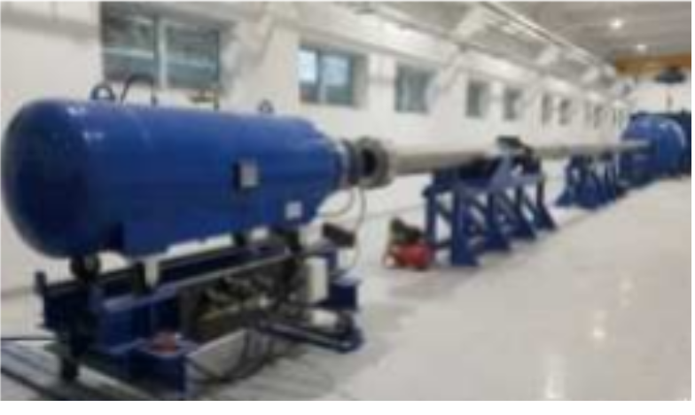
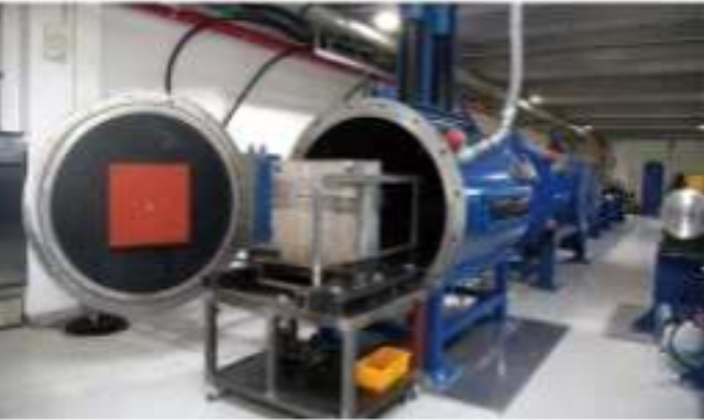
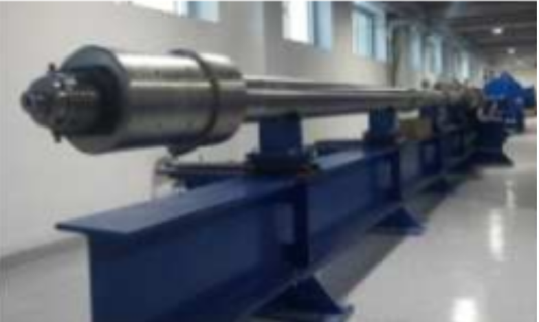
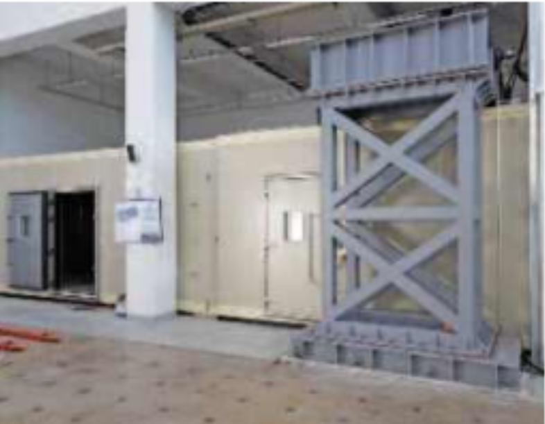
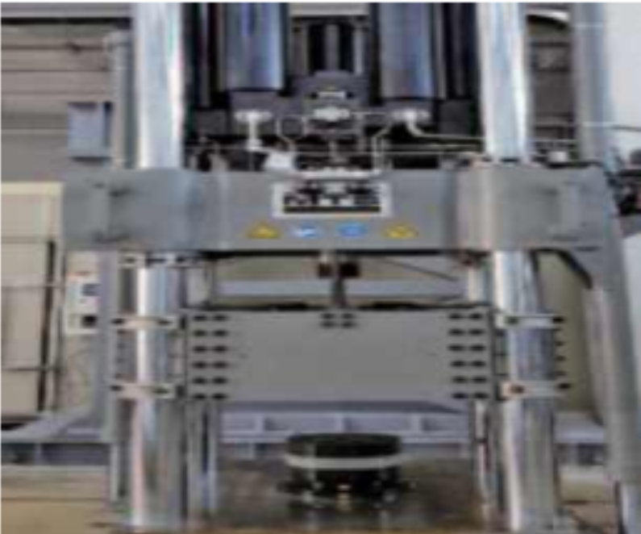
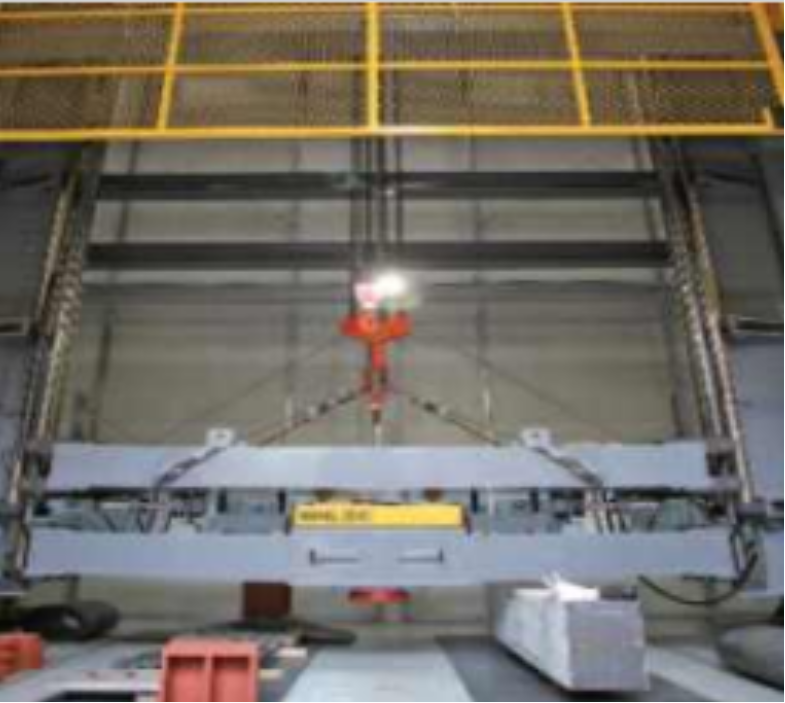

<!-- bbox: [16,40,609,73] -->
### 국방과학연구센터 주요 실험장비 보유 현황 (source:https://ieee.snu.ac.kr/en/node/93)

<!-- bbox: [16,90,984,961] -->
<table class="data-table">
<tbody>
<tr>
<th>중속가스건</th>
<th>고속가스건</th>
<th>초고속가스건</th>
</tr>
<tr>
<td></td>
<td></td>
<td></td>
</tr>
<tr>
<td>
<ul>
<li class="block" data-bbox="52,342,343,397" data-id="b002g">소개: 공기 압축식으로 발사체를 발사하여 운동 및 방호구조 충돌실험</li>
<li class="block" data-bbox="52,414,191,442" data-id="b002h">비행체 무게: 10 ~ 100 kg</li>
<li class="block" data-bbox="52,459,190,486" data-id="b002i">유입속도: 220 ~ 470 m/s</li>
</ul>
</td>
<td>
<ul>
<li class="block" data-bbox="388,342,643,397" data-id="b002j">가스(질소, 헬륨)의 압축력을 분사한 실린더로 발사, 방호구조 충돌실험</li>
<li class="block" data-bbox="388,414,516,442" data-id="b002k">비행체 무게: 0.5 ~ 5 kg</li>
<li class="block" data-bbox="388,459,524,486" data-id="b002l">유입속도: 0.5 ~ 1.2 km/s</li>
</ul>
</td>
<td>
<ul>
<li class="block" data-bbox="688,345,958,394" data-id="b002m">화약추진제, 가스(헬륨, 수소)의 압축력으로 발사한 비행체 주로 미세입자 충돌실험</li>
<li class="block" data-bbox="688,414,821,442" data-id="b002n">비행체 무게: 25 ~ 200 g</li>
<li class="block" data-bbox="688,459,814,486" data-id="b002o">유입속도: 2.5 ~ 7 km/s</li>
</ul>
</td>
</tr>
<tr>
<th>극한온도실험시설</th>
<th>급속취체복기</th>
<th>자유낙하시험기</th>
</tr>
<tr>
<td></td>
<td></td>
<td></td>
</tr>
<tr>
<td>
<ul>
<li class="block" data-bbox="52,778,343,832" data-id="b002p">극한온도 하에서의 500 kN UTM을 활용한 인장 및 압축의 재하, 동적 거동 특성 평가</li>
<li class="block" data-bbox="52,849,187,877" data-id="b002q">크기: 5 m × 12 m × 3 m</li>
<li class="block" data-bbox="52,894,156,921" data-id="b002r">온도: -40 ~ 160 ℃</li>
</ul>
</td>
<td>
<ul>
<li class="block" data-bbox="388,764,643,819" data-id="b002s">유압을 이용한 고속의 동적 충격을 재하하여 재료의 충격 특성 평가</li>
<li class="block" data-bbox="388,836,643,890" data-id="b002t">최대 속도: 5 m/s 부하속도에서 동적 압축하중 320 kN</li>
<li class="block" data-bbox="388,907,639,935" data-id="b002u">10 m/s 부하속도에서의 동적 압축하중 320 kN</li>
</ul>
</td>
<td>
<ul>
<li class="block" data-bbox="688,791,955,819" data-id="b002v">추의 자유낙하를 통한 고중량 충돌 충격 실험 수행</li>
<li class="block" data-bbox="688,836,775,863" data-id="b002w">낙하 높이: 15 m</li>
<li class="block" data-bbox="688,880,746,907" data-id="b002x">추무게: 3 t</li>
</ul>
</td>
</tr>
</tbody>
</table>

<!-- bbox: [27,162,189,290] -->

<!-- bbox: [363,162,525,290] -->

<!-- bbox: [663,162,825,290] -->

<!-- bbox: [52,342,343,397] -->
- 소개: 공기 압축식으로 발사체를 발사하여 운동 및 방호구조 충돌실험

<!-- bbox: [52,414,191,442] -->
- 비행체 무게: 10 ~ 100 kg

<!-- bbox: [52,459,190,486] -->
- 유입속도: 220 ~ 470 m/s

<!-- bbox: [388,342,643,397] -->
- 가스(질소, 헬륨)의 압축력을 분사한 실린더로 발사, 방호구조 충돌실험

<!-- bbox: [388,414,516,442] -->
- 비행체 무게: 0.5 ~ 5 kg

<!-- bbox: [388,459,524,486] -->
- 유입속도: 0.5 ~ 1.2 km/s

<!-- bbox: [688,345,958,394] -->
- 화약추진제, 가스(헬륨, 수소)의 압축력으로 발사한 비행체 주로 미세입자 충돌실험

<!-- bbox: [688,414,821,442] -->
- 비행체 무게: 25 ~ 200 g

<!-- bbox: [688,459,814,486] -->
- 유입속도: 2.5 ~ 7 km/s

<!-- bbox: [27,584,151,712] -->

<!-- bbox: [363,584,479,712] -->

<!-- bbox: [663,584,771,712] -->

<!-- bbox: [52,778,343,832] -->
- 극한온도 하에서의 500 kN UTM을 활용한 인장 및 압축의 재하, 동적 거동 특성 평가

<!-- bbox: [52,849,187,877] -->
- 크기: 5 m × 12 m × 3 m

<!-- bbox: [52,894,156,921] -->
- 온도: -40 ~ 160 ℃

<!-- bbox: [388,764,643,819] -->
- 유압을 이용한 고속의 동적 충격을 재하하여 재료의 충격 특성 평가

<!-- bbox: [388,836,643,890] -->
- 최대 속도: 5 m/s 부하속도에서 동적 압축하중 320 kN

<!-- bbox: [388,907,639,935] -->
- 10 m/s 부하속도에서의 동적 압축하중 320 kN

<!-- bbox: [688,791,955,819] -->
- 추의 자유낙하를 통한 고중량 충돌 충격 실험 수행

<!-- bbox: [688,836,775,863] -->
- 낙하 높이: 15 m

<!-- bbox: [688,880,746,907] -->
- 추무게: 3 t

<!-- bbox: [16,40,609,73] -->
### 국방과학연구센터 주요 실험장비 보유 현황 (source:https://ieee.snu.ac.kr/en/node/93)
