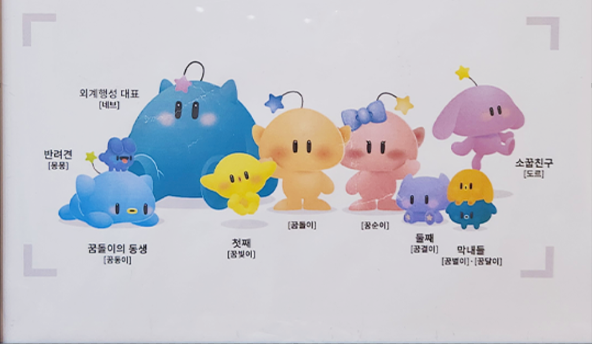

<!-- bbox: [16,44,252,102] -->
# 꿈돌이 패밀리와 찰칵!

<!-- bbox: [16,134,490,482] -->

<!-- bbox: [16,521,212,546] -->
*꿈돌이 패밀리와 찰칵! 캐릭터 이미지*

<!-- bbox: [16,567,148,606] -->
## 꿈씨패밀리 소개

<!-- bbox: [16,622,211,647] -->
#꿈씨패밀리 #꿈부부 #외계인친구들

<!-- bbox: [509,20,984,557] -->
<table class="data-table block" data-bbox="509,20,984,557" data-id="b015">
<tbody><tr>
<td><b>이름</b></td>
<td><b>설명</b></td>
</tr>
<tr>
<td>꿈부부의 첫째 아이 꿈빛이</td>
<td>과학을 가장 좋아하는 꿈씨패밀리의 첫째 아이. 제일 꼼꼼하고 부부를 쏙 빼닮아 단정하다.</td>
</tr>
<tr>
<td>꿈부부의 둘째 아이 꿈결이</td>
<td>대화와 예절을 사랑하는 꿈씨패밀리 둘째 아이. 엄마 꿈순이를 쏙 빼닮은 것이 특징이다.</td>
</tr>
<tr>
<td>꿈부부의 막내 쌍둥이 꿈별이</td>
<td>꿈부부가 가장 최근에 낳은 막내 이란성 쌍둥이.</td>
</tr>
<tr>
<td>꿈부부의 막내 쌍둥이 꿈달이</td>
<td>꿈부부가 가장 최근에 낳은 막내 이란성 쌍둥이.</td>
</tr>
<tr>
<td>꿈부부의 막내 쌍둥이 꿈동이</td>
<td>꿈동이는 꿈돌이의 친동생으로, 쌍둥이 막내 중 한 명이다.</td>
</tr>
<tr>
<td>외계행성 대표 네브</td>
<td>외계행성에서 온 대표로, 꿈씨패밀리와 친구가 되었다.</td>
</tr>
<tr>
<td>꿈씨 가족의 반려견 몽몽</td>
<td>늘 밝고 건강한 성격의 반려견. 꿈씨패밀리와 함께 지낸다.</td>
</tr>
<tr>
<td>소꿉친구 도르</td>
<td>꿈씨패밀리와 어릴 때부터 함께한 소꿉친구.</td>
</tr>
</tbody></table>

<!-- bbox: [509,575,585,606] -->
### 등장 캐릭터

<!-- bbox: [535,622,644,647] -->
- 외계행성 대표 [네브]

<!-- bbox: [535,663,605,689] -->
- 반려견 [몽몽]

<!-- bbox: [535,705,656,730] -->
- 꿈돌이의 동생 [꿈동이]

<!-- bbox: [535,746,605,772] -->
- 첫째 [꿈빛이]

<!-- bbox: [535,788,570,813] -->
- 꿈돌이

<!-- bbox: [535,829,570,855] -->
- 꿈순이

<!-- bbox: [535,871,605,896] -->
- 둘째 [꿈결이]

<!-- bbox: [535,912,655,938] -->
- 막내들 [꿈별이·꿈달이]

<!-- bbox: [535,954,617,980] -->
- 소꿉친구 [도르]

<!-- bbox: [16,44,252,102] -->
# 꿈돌이 패밀리와 찰칵!

<!-- bbox: [16,567,148,606] -->
## 꿈씨패밀리 소개

<!-- bbox: [509,575,585,606] -->
### 등장 캐릭터