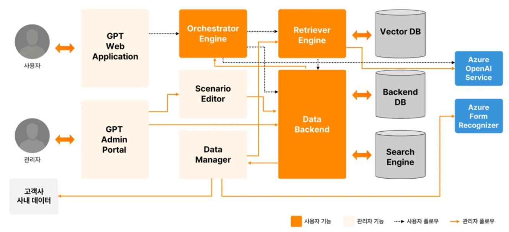
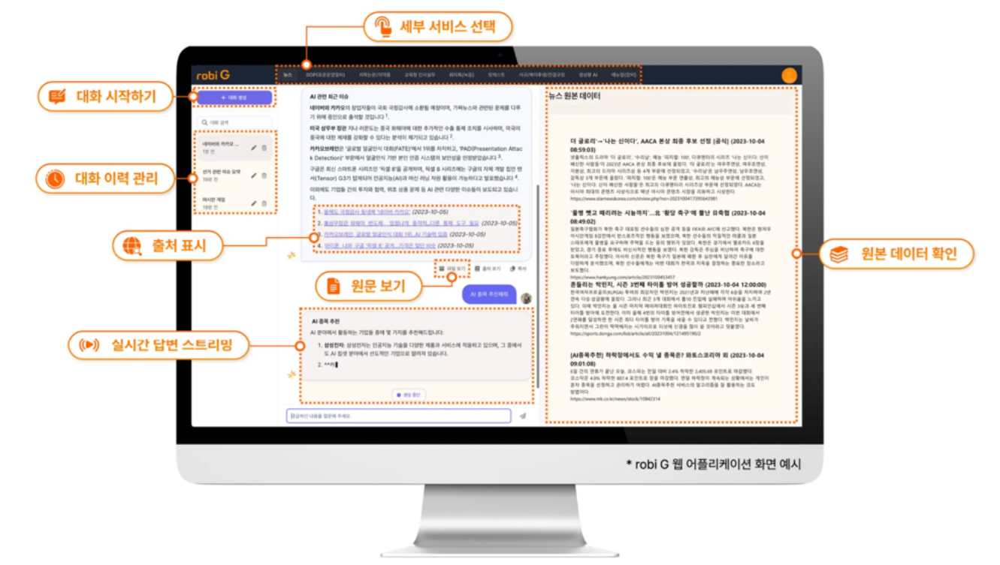

<!-- bbox: [16,38,269,88] -->
# robi G 소프트웨어 구성

<!-- bbox: [16,116,490,352] -->

<!-- bbox: [16,385,151,407] -->
*robi G 소프트웨어 구성도*

<!-- bbox: [41,421,159,443] -->
- GPT Web Application

<!-- bbox: [41,457,139,479] -->
- GPT Admin Portal

<!-- bbox: [41,493,153,515] -->
- Orchestrator Engine

<!-- bbox: [41,528,125,551] -->
- Scenario Editor

<!-- bbox: [41,564,121,586] -->
- Data Manager

<!-- bbox: [41,600,132,622] -->
- Retriever Engine

<!-- bbox: [41,636,118,658] -->
- Data Backend

<!-- bbox: [41,672,96,694] -->
- Vector DB

<!-- bbox: [41,708,108,730] -->
- Backend DB

<!-- bbox: [41,744,120,766] -->
- Search Engine

<!-- bbox: [41,779,162,802] -->
- Azure OpenAI Service

<!-- bbox: [41,815,171,837] -->
- Azure Form Recognizer

<!-- bbox: [16,855,335,888] -->
## 엔터프라이즈를 위한 생성형 AI, robi G

<!-- bbox: [509,31,984,324] -->

<!-- bbox: [509,357,672,379] -->
*robi G 애플리케이션 화면 예시*

<!-- bbox: [535,393,609,415] -->
- 대화 시작하기

<!-- bbox: [535,429,613,451] -->
- 대화 이력 관리

<!-- bbox: [535,464,586,487] -->
- 출력 표시

<!-- bbox: [535,500,649,522] -->
- 실시간 문단 스트리밍

<!-- bbox: [535,536,625,558] -->
- 서버 서비스 선택

<!-- bbox: [535,572,586,594] -->
- 질문 보기

<!-- bbox: [535,608,625,630] -->
- 관련 데이터 확인

<!-- bbox: [509,644,984,983] -->
<table class="data-table">
<thead>
<tr>
<th>기능</th>
<th>robi G</th>
<th>ChatGPT</th>
</tr>
</thead>
<tbody>
<tr>
<td>기업 내부 문서 활용</td>
<td>HTML, PDF, Word, Excel 등 기업이 보유한 다양한 문서와 Azure AI 기반 사내 데이터 연동 가능</td>
<td>개별 파일이나 외부 링크 업로드만 지원 (기업 내부 문서 연동 불가)</td>
</tr>
<tr>
<td>대화 이력 관리</td>
<td>대화 이력 저장, 검색, 재활용 등 체계적 관리 가능</td>
<td>대화 이력 저장 및 관리 기능 미제공</td>
</tr>
<tr>
<td>보안 및 개인정보 보호</td>
<td>기업 전용 서버 및 네트워크 환경에서 안전하게 운영</td>
<td>외부 서버(해외)로 데이터 전송, 보안 우려 존재</td>
</tr>
<tr>
<td>맞춤형 서비스 제공</td>
<td>업무별, 부서별 맞춤형 시나리오 및 기능 제공</td>
<td>일반적인 대화 기능만 제공, 맞춤형 서비스 미제공</td>
</tr>
</tbody>
</table>

<!-- bbox: [16,38,269,88] -->
# robi G 소프트웨어 구성

<!-- bbox: [16,855,335,888] -->
## 엔터프라이즈를 위한 생성형 AI, robi G

<!-- bbox: [509,644,984,983] -->
<table class="data-table">
<thead>
<tr>
<th>기능</th>
<th>robi G</th>
<th>ChatGPT</th>
</tr>
</thead>
<tbody>
<tr>
<td>기업 내부 문서 활용</td>
<td>HTML, PDF, Word, Excel 등 기업이 보유한 다양한 문서와 Azure AI 기반 사내 데이터 연동 가능</td>
<td>개별 파일이나 외부 링크 업로드만 지원 (기업 내부 문서 연동 불가)</td>
</tr>
<tr>
<td>대화 이력 관리</td>
<td>대화 이력 저장, 검색, 재활용 등 체계적 관리 가능</td>
<td>대화 이력 저장 및 관리 기능 미제공</td>
</tr>
<tr>
<td>보안 및 개인정보 보호</td>
<td>기업 전용 서버 및 네트워크 환경에서 안전하게 운영</td>
<td>외부 서버(해외)로 데이터 전송, 보안 우려 존재</td>
</tr>
<tr>
<td>맞춤형 서비스 제공</td>
<td>업무별, 부서별 맞춤형 시나리오 및 기능 제공</td>
<td>일반적인 대화 기능만 제공, 맞춤형 서비스 미제공</td>
</tr>
</tbody>
</table>