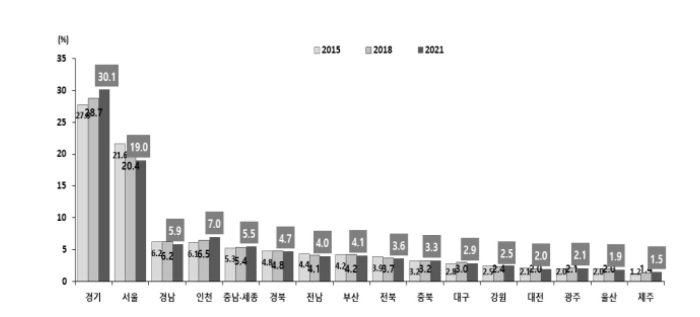

<!-- bbox: [16,96,221,186] -->
## Ⅱ. 가구 구성표 분석 결과

<!-- bbox: [16,261,490,900] -->

<!-- bbox: [509,47,984,828] -->
*다문화가구의 16개 시·도별 분포(2015, 2018, 2021)[그림 Ⅱ-1]
        다문화가구의 16개 시·도별 분포(2015, 2018, 2021)다문화가구 지역별 분포를 우리나라 전체
        가구의 지역별 분포와 비교하면, 경기, 인천, 서울, 경남, 충남·세종, 전남, 충북, 제주와 같은 지역은 우리나라 전체 가구의 분포 비율보다 다문화가구의 분포 비율이 상대적으로 높다. 특히 경기의
        경우, 우리나라 전체 가구에서 차지하는 비율은 24.9% 수준이나, 다문화가구에서는 30.1%가 집중되어 있어 상대적 비율의 차이가 매우 큰 편이다. 반면, 경남, 부산, 대구, 강원, 광주, 대전,
        울산과 같은 지역은 전체 가구의 분포 비율보다 다문화가구의 비율이 상대적으로 낮으며, 특히 부산(다문화 4.1%, 전체 6.6%)과 대구(다문화 2.9%, 전체 4.5%)가 특히 전체 가구 비율 대비
        다문화가구의 비율이 눈에 띄게 낮은 편이다.Bar chart comparing multicultural households and total households by 16
        cities/provinces다문화가구의 16개 시·도별 분포(국내 가구 전체)[그림 Ⅱ-2] 다문화가구의 16개 시·도별 분포(국내 가구 전체)자료: 우리나라 전체 가구, 행정안전부, 주민등록
        인구통계, 주민등록 인구 및 세대현황. 2022년 3월 2일자 통계현황. http://27.101.213.4/index.jsp#*

<!-- bbox: [16,96,221,186] -->
## Ⅱ. 가구 구성표 분석 결과