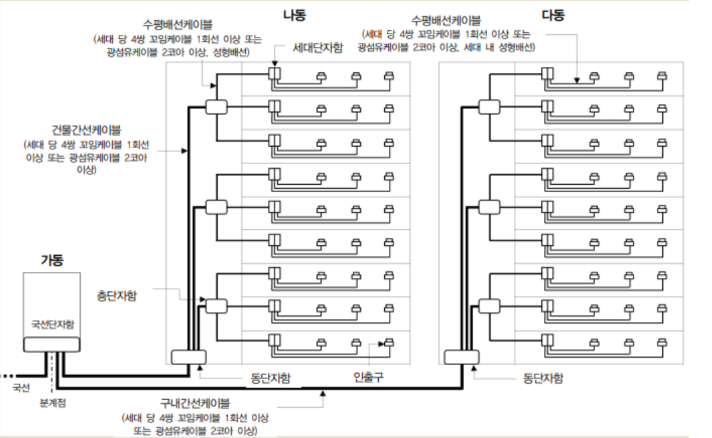
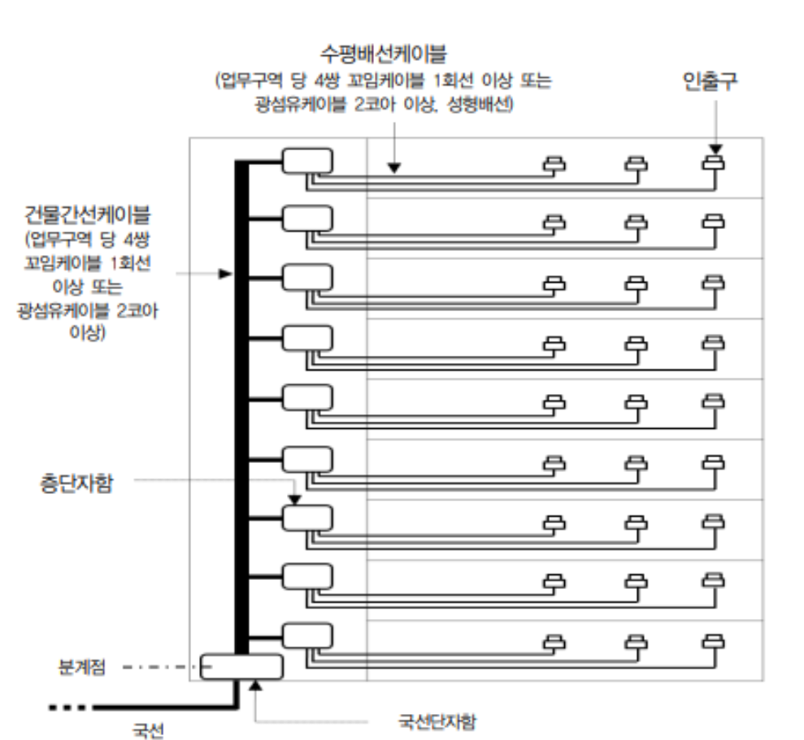

<!-- bbox: [16,60,357,138] -->
# 2. 두 개 이상의 공동주택인 경우

<!-- bbox: [16,181,490,682] -->

<!-- bbox: [16,734,491,873] -->
*공동주택 구내배선도 예시주) 국선단자함과 동단자함이 광다중화 기능을 갖는 경우,
        구내간선케이블은 광섬유케이블 8코어 이상. 동단자함에서 세대단자함 또는 인출구까지의 건물간선케이블 및
        수평배선케이블은 단위세대당 1회선(4쌍 꼬임케이블 기준) 이상 또는 광섬유케이블 2코어 이상으로 설치할 수 있다.[별표 12] (제33조제2항 관련)*

<!-- bbox: [16,901,346,953] -->
## 업무용 및 기타건축물의 구내배선 표준도

<!-- bbox: [509,27,667,69] -->
### 1. 한 개의 건축물인 경우

<!-- bbox: [509,112,984,860] -->

<!-- bbox: [509,912,734,947] -->
*업무용 및 기타건축물 구내배선도 예시134*

<!-- bbox: [16,60,357,138] -->
# 2. 두 개 이상의 공동주택인 경우

<!-- bbox: [16,901,346,953] -->
## 업무용 및 기타건축물의 구내배선 표준도

<!-- bbox: [509,27,667,69] -->
### 1. 한 개의 건축물인 경우