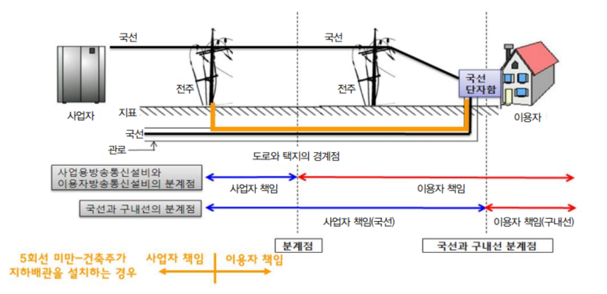

<!-- bbox: [16,35,391,69] -->
## 착공 전 설계도 확인 및 사용 전 검사 기준 해설

<!-- bbox: [41,82,643,104] -->
- 과학기술정보통신부장관이 별도로 고시하는 경우에는 이에 따라야 함 ※ '18년 12월 현재
          별도로
          정한 고시는 없음

<!-- bbox: [41,118,984,163] -->
- (제2항제2호) 이용자는 도로와 택지 또는 공동주택단지의 각 단지와의 경계점인 대지경계점을
          기준으로, 대지경계선 안쪽에 설치하는 방송통신설비에 대해 설치·유지 및 관리의 책임을 가지며, 그
          바깥쪽에 설치하는 설비는 사업자가 설치·유지 및 관리의 책임을 가짐(관로 분계점 또는 대지분계점)

<!-- bbox: [41,176,981,199] -->
- 다만, 통신선의 경우에는 예외적으로 이용자의 건축물에 설치되어 사업자의 통신선(국선)과
          이용자의
          통신선(구내선)을 연결하는 접속점(국선단자함)을 분계점으로 함(선로 분계점)

<!-- bbox: [41,307,949,788] -->

<!-- bbox: [41,822,605,844] -->
*방송통신설비 분계점 설명도: 사업자와 이용자 책임 구분, 도로와 택지의
            경계점, 국선과 구내선의 분계점 등*

<!-- bbox: [41,858,984,969] -->
<table class="data-table block" data-bbox="41,858,984,969" data-id="b008">
<tbody>
<tr>
<td>사업용방송통신설비와 이용자방송통신설비의 분계점</td>
<td>사업자 책임</td>
<td>이용자 책임</td>
</tr>
<tr>
<td>국선과 구내선의 분계점</td>
<td>사업자 책임(국선)</td>
<td>이용자 책임(구내선)</td>
</tr>
<tr>
<td>5회선 미만·건축주가 지하배관을 설치하는 경우</td>
<td>사업자 책임</td>
<td>이용자 책임</td>
</tr>
</tbody>
</table>

<!-- bbox: [16,35,391,69] -->
## 착공 전 설계도 확인 및 사용 전 검사 기준 해설