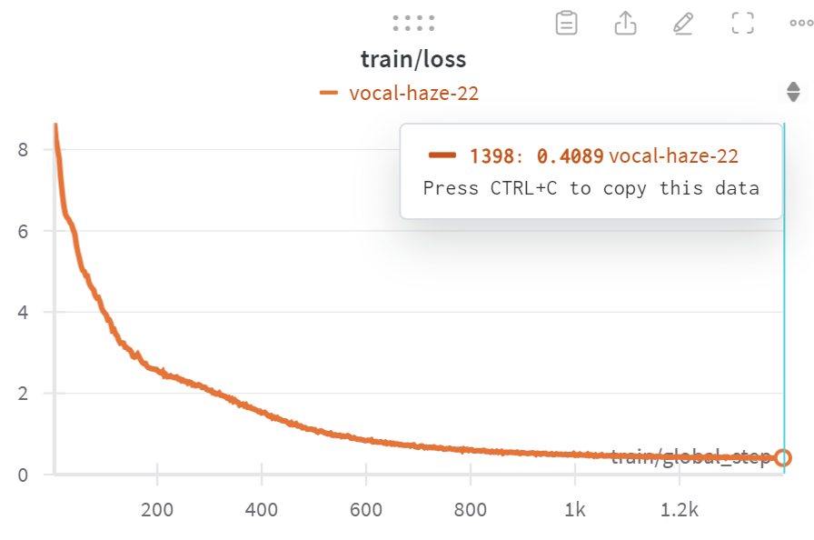
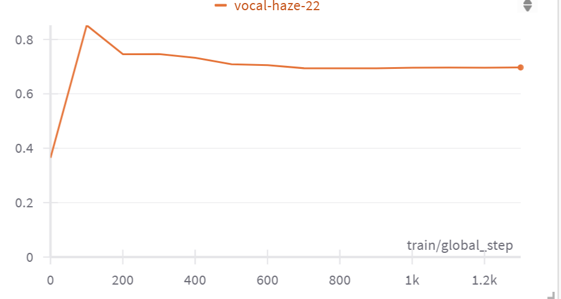
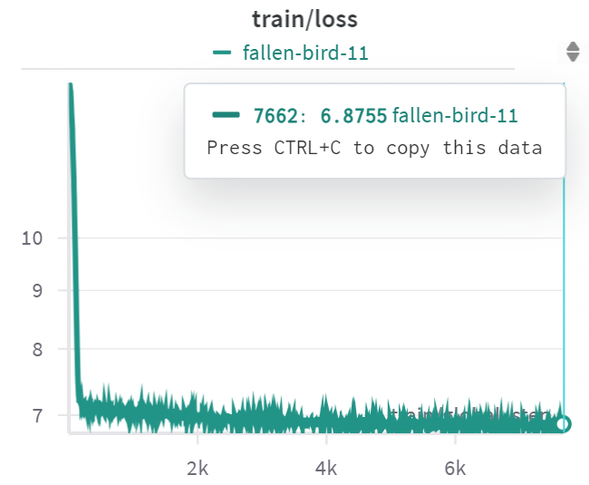
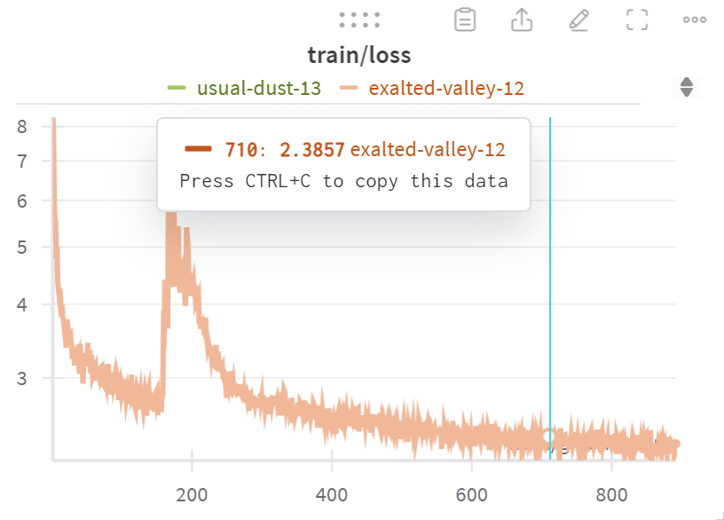

<!-- bbox: [28,48,297,48] -->
# LLM 한국어-영어 통합 방법 실험

<!-- bbox: [28,104,25,28] -->
## 목표

<!-- bbox: [28,140,309,53] -->
Llama 모델의 vocab expansion 버전을 한국어와 영어가 같은 semantic space에서 표현되도록 변경

<!-- bbox: [28,209,208,109] -->
- 영어와 같은 의미의 한글 입력에 대해 동일한 출력 생성
- 한글에서도 영어 benchmark와 비슷한 성능 달성
- 준비된 학습 Dataset
  - Parallel dataset - stage 1에서 활용

<table>
  <thead>
    <tr>
<!-- bbox: [28,334,309,215] -->
      <th>데이터셋</th>
      <th>설명</th>
      <th>Train</th>
      <th>Validation</th>
    </tr>
  </thead>
  <tbody>
    <tr>
      <td>AIhubK2EBroadcast</td>
      <td>방송콘텐츠 번역 말뭉치</td>
      <td>521,651</td>
      <td>65,431</td>
    </tr>
    <tr>
      <td>AIhubK2ECorpus</td>
      <td>병렬 번역 말뭉치</td>
      <td>1,602,418</td>
      <td>-</td>
    </tr>
    <tr>
      <td>AIhubK2ESciTech</td>
      <td>전문분야 한영 말뭉치</td>
      <td>1,195,228</td>
      <td>149,403</td>
    </tr>
    <tr>
      <td>AIhubK2ESoSci</td>
      <td>기술과학 번역 말뭉치</td>
      <td>1,210,529</td>
      <td>151,316</td>
    </tr>
    <tr>
      <td>AIhubK2EExpert</td>
      <td>사회과학 번역 말뭉치</td>
      <td>1,200,000</td>
      <td>150,000</td>
    </tr>
    <tr>
      <td><strong>Total</strong></td>
      <td></td>
      <td><strong>5,729,826</strong></td>
      <td><strong>516,150</strong></td>
    </tr>
  </tbody>
</table>

<!-- bbox: [28,565,68,28] -->
## 평가 metric

<!-- bbox: [28,601,309,228] -->
- evaluation task
  - 영어 원본이 한글로 번역된 데이터 (arc_challenge → ko_arc_challenge)
  - 정확히 1:1 대응되는 데이터 셋으로 영어 지식이 한글로 trasfer되었는지 살펴보기 좋은 데이터 셋
- 영어 - 한글 dataset에서 align되는 정도 (일치도)
  - 위 평가 task에서 각 example 의 output으로 같은 응답을 출력하는지, 같은 응답을 출력하는 응답의 비율
- 평가 툴
  - https://github.com/davidkim205/kollm_evaluation을 활용한

<!-- bbox: [28,845,57,28] -->
## Baselines

<!-- bbox: [28,881,309,80] -->
- **princeton-nlp/Sheared-LLaMA-1.3B-ShareGPT**: 실험 중인 모델의 base 모델 (대조군)
- **EleutherAI/polyglot-ko-1.3b**: 한국어를 잘하는 1.3B 모델

<!-- bbox: [363,48,37,28] -->
## 실험들

<!-- bbox: [363,84,291,124] -->
- 실험 0) 3개의 stage로 나누어 실험 (**1st stage**: consrastive learning(CL) → **2nd stage**: training LM head with freezing the other layers → **3rd stage**: pretraining with Korean and English)
- Stage1) contrastive learning to train embedding layer and all of the transformer layers for integrating Korean and English

<!-- bbox: [363,457,291,201] -->

validation set의 한국어 representation과 영어 representation 사이의 cosine similarity

<!-- bbox: [680,48,274,31] -->
Stage2) training LM head with freezing the other layers and Korean data.

<!-- bbox: [680,335,291,74] -->
- Stage3) pretraining with Korean and English for injecting knowledge
  - 데이터에 영어와 한국어서 섞여서 그런지 시작하는 loss가 Stage2)의 것보다 좀 높다

<!-- bbox: [680,721,40,23] -->
### 평가 대상

<!-- bbox: [680,753,163,30] -->
- 3번째 stage인 full finetuning이 끝난 모델
