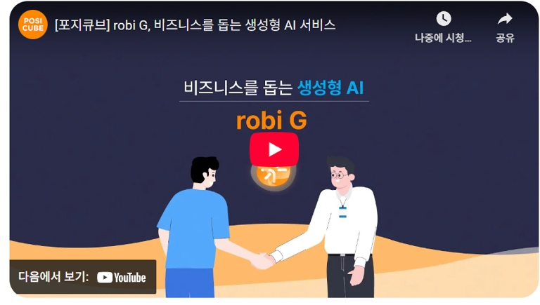
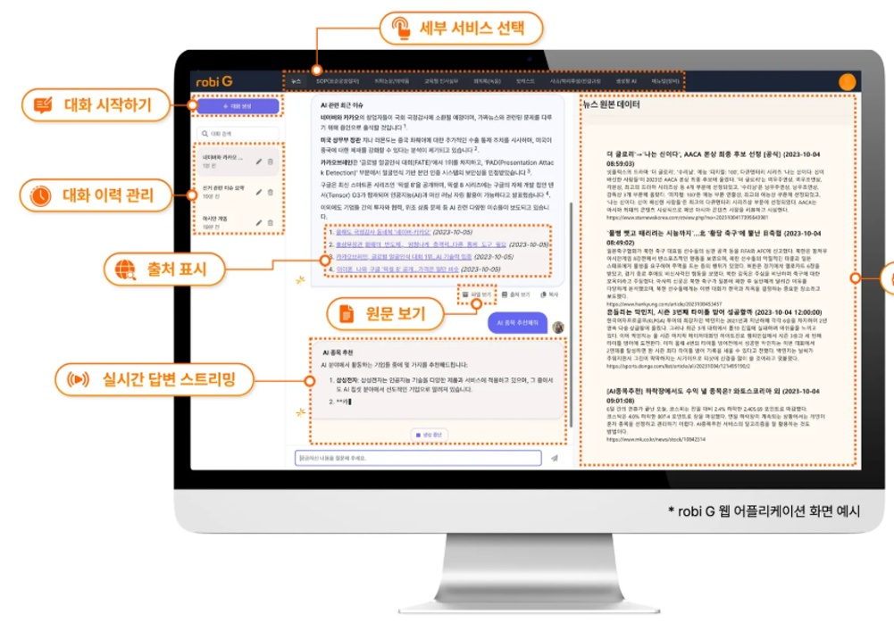
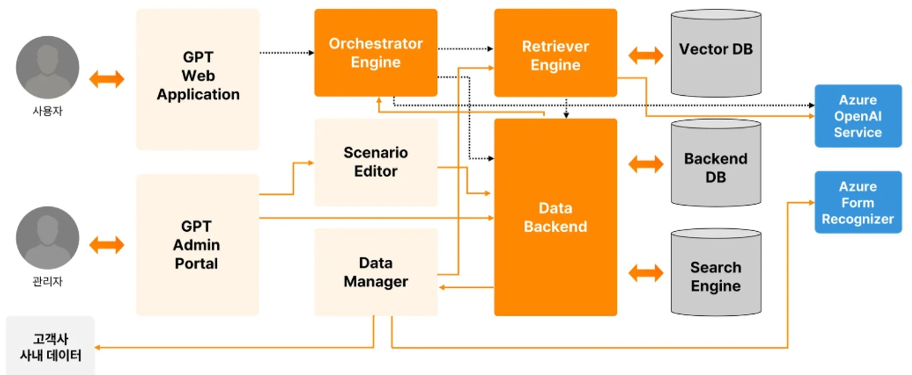
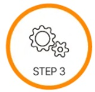

<!-- bbox: [15,33,21,17] -->
### 생성형 AI

<!-- bbox: [15,67,16,18] -->
## robi G

<!-- bbox: [15,91,40,15] -->
대화형 Gen-AI 서비스

<!-- bbox: [343,33,117,24] -->
## 엔터프라이즈를 위한 생성형 AI, robi G

<!-- bbox: [343,64,226,18] -->
robi G는 LLM에 포지쿼브의 AI 서비스 개발 및 운영 노하우를 담아 더욱 강력하고 편리한 기업용 생성형 서비스입니다.

<!-- bbox: [343,92,255,18] -->
고객사 상황과 목적에 따라 활용 방식은 물론 세부 기능까지 자유롭게 조절할 수 있어 비즈니스에 최적화된 서비스를 제공해드립니다.

---

<!-- bbox: [23,434,47,19] -->
### 기업 내부 문서 활용

<!-- bbox: [23,460,82,73] -->
기업이 보유한 문서라면 HTML, PDF, Word, Excel 등 웹 및 파일 형태의 모든 자료를 데이터셋으로 구축하여 AI 검색에 활용할 수 있습니다.

---

<!-- bbox: [131,434,44,19] -->
### 할루시네이션 차단

<!-- bbox: [131,460,82,73] -->
robi G는 고객사 데이터로 구성한 지식 베이스에 근거하여 GPT 챗봇의 주요 문제였던 힐루시네이션 없이 믿을 수 있는 답변만 제공합니다.

---

<!-- bbox: [239,434,58,19] -->
### 완전 자동화된 AI 서비스

<!-- bbox: [239,460,82,55] -->
robi G는 데이터 소스 관리부터 데이터 업로드, 인덱스 생성 등 서비스 전반의 기능을 관리콘솔을 통해 자동화할 수 있습니다.

---

<!-- bbox: [23,586,56,19] -->
### robi G 소프트웨어 구성

<!-- bbox: [23,622,298,37] -->
robi G는 문서 기반의 생성형 AI 플랫폼 서비스로 기업 내부 문서를 의미 단위로 임베딩하여 사용자의 질문 의도에 맞는 답변을 생성합니다.  
이때, 사용자 권한에 따라 사용 가능한 기능을 제한하거나 보안 모니터링 기능 등을 적용하여 고객사의 민감정보를 안전하게 보호합니다.

---

<!-- bbox: [351,380,23,19] -->
### 기능 비교

<!-- bbox: [351,415,298,199] --><table>
<tr>
<td>기능</td>
<td>robi G</td>
<td>ChatGPT</td>
</tr>
<tr>
<td>기업 내부 문서 활용</td>
<td>✓ HTML, PDF, Word, Excel 등 기업 내부 문서를 Azure 전용 테넌트에 업로드하여 활용 가능</td>
<td>✗ 기업 기밀·개인정보 유출 위험으로 내부 문서 업로드 비권장</td>
</tr>
<tr>
<td>도메인 특화</td>
<td>✓ 산업별 전문 용어·약어 등 도메인 특화 지식 활용 가능</td>
<td>✗ 범용 데이터 기반으로 전문 답변 한계</td>
</tr>
<tr>
<td>답변 출처 제공</td>
<td>✓ 답변 출처·요약 제공 가능</td>
<td>✗ 출처 명시 어려움</td>
</tr>
<tr>
<td>부가기능 간편 추가</td>
<td>✓ Azure 및 3rd Party 기능 쉽게 확장 가능</td>
<td>✗ 별도 파인튜닝 필요, 비용·유지보수 부담</td>
</tr>
</table>

---

<!-- bbox: [351,657,33,19] -->
### 도입 프로세스

<!-- bbox: [351,693,191,18] -->
간단한 3단계 프로세스로 컨설팅부터 도입 후 유지 관리까지 쉽고 간편하게 robi G를 도입해 보세요.

<!-- bbox: [351,727,216,18] -->
포지쿱브의 AI 전문가들이 안전하고 정확한 GPT 서비스로 귀사의 비즈니스 혁신을 돕기 위해 기다리고 있습니다.

---

<!-- bbox: [357,821,42,18] -->
### 도입협의 및 컨설팅

<!-- bbox: [357,846,40,87] -->
- 기업요구사항정의
- 샘플데이터확인
- 기업DB구축현황파악
- AI모델링

---

<!-- bbox: [468,821,28,18] -->
### 구축 및 운영

<!-- bbox: [468,846,50,87] -->
- DB 보안 연결 및 임베딩
- 벡터 검색 엔진 적용
- UIUX 디자인
- 프롬프트 엔지니어링 적용

---

<!-- bbox: [578,821,28,18] -->
### 유지 및 관리

<!-- bbox: [578,846,56,87] -->
- 프롬프트 최적화
- AI 모델 업데이트 제공
- 시스템 유지보수 및 업데이트
- 장애 대응 서비스 제공

---

<!-- bbox: [679,380,45,19] -->
### 비즈니스 활용 영역

<!-- bbox: [679,415,181,18] -->
robi G는 셀프 고객 서비스나 사내 업무 가이드 등 다양한 업무 환경에서 활용하실 수 있습니다.

<!-- bbox: [679,450,205,18] -->
금융, 제조, 유통 등 글로벌 기업부터 공공기관이나 연구소 등 비영리 단체까지 어디서나 활용도가 높습니다.

---

<!-- bbox: [686,502,24,18] -->
**A사 | 제조**

<!-- bbox: [686,524,81,37] -->
외부 정보(뉴스, 컨텐츠 등) DB를 활용한 특정 정보 검색 및 요약 챗봇

<!-- bbox: [788,502,24,18] -->
**B사 | 건설**

공사·용역·자재 계약서 검토 및 정보 검색 서포트 챗봇

<!-- bbox: [890,502,28,18] -->
**C사 | 연구소**

<!-- bbox: [890,524,81,37] -->
기술지원 매뉴얼 기반 임직원·외부 고객용 가이드 챗봇

<!-- bbox: [686,632,24,18] -->
**D사 | 금융**

대출·적금 등 금융 상품 추천 챗봇

<!-- bbox: [788,632,38,18] -->
**E시청 | 공공기관**

<!-- bbox: [788,654,81,37] -->
내부 AICC·유통 시스템 연계 대고객 챗봇

<!-- bbox: [890,632,23,18] -->
**F사 | 유통**

<!-- bbox: [890,654,81,37] -->
일반 민원(CS) 응대 및 임직원 업무 가이드 챗봇

<!-- bbox: [679,738,73,18] -->
- 실제 포지쿼브와 논의한 고객사 사례
