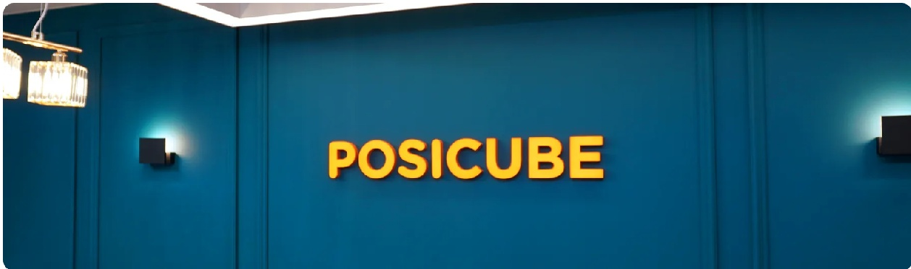
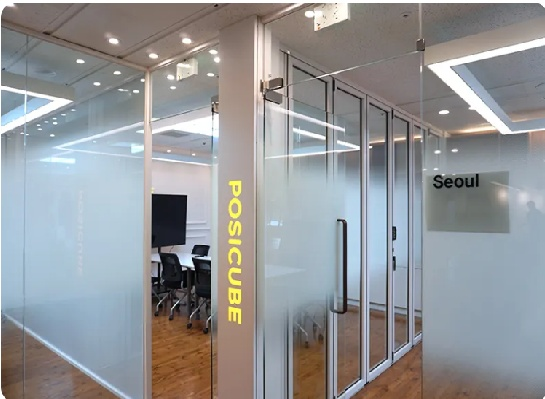

<!-- bbox: [27,43,73,49] -->
# 회사소개 
<!-- bbox: [27,106,279,62] -->
포지큐브는 AI 기술 전문 회사로  
공공기관 및 민간기업에게 **AI Voice & Vision 서비스를 제공합니다**

<!-- bbox: [27,544,294,63] -->
우리는 삶과 비즈니스에 실제로 적용되는 AI 프로덕트와 서비스를 만들고 있습니다.

<!-- bbox: [27,615,294,63] -->
주요 사업 영역은 생성형 AI (GPT 챗봇)와 대화형 AI (AICC, AI 전화 음대 서비스) 및 비전 AI (AI OCR, Fake Detection) 입니다.

<!-- bbox: [27,687,288,32] -->
AI 기술이 우리 삶의 당연한 일부분이 되는 그 날을 향해 노력하고 있습니다.

---

<!-- bbox: [362,57,23,31] -->
## 미션 
<!-- bbox: [362,120,256,29] -->
**포지큐브는 고객이 AI를 통해 보다 높은 가치를 만들 수 있도록 돕습니다.**

<!-- bbox: [362,164,207,29] -->
**포지큐브는 비즈니스를 위한 AI 기술과 서비스를 만듭니다.**

<!-- bbox: [362,207,277,87] -->
단순히 AI 기술로 보여줄 수 있는 새로운 무엇인가를 만들어내거나,  
인간을 대체하는 생산성을 위한 도구만을 개발하는 회사가 아닙니다.  
AI 기술은 실제 사용자가 원하는 방식으로 설계되고 서비스로서 활용되어야 합니다.

<!-- bbox: [362,309,179,29] -->
**포지큐브의 AI는 사람들을 도와주는 협력자입니다.**

<!-- bbox: [362,352,277,117] -->
AI는 모든 영역에서 사람의 일을 대체할 수 없습니다.  
기존의 SW 슬루션으로 해결하지 못하는 영역과 단순하고 반복적인 영역을 효율화하는데 집중합니다.  
기업과 고객들이 AI 기술과 서비스를 사용하여 보다 더 나은 가치를 만들 수 있도록 돕습니다.

---

 ## 비전 
<!-- bbox: [688,120,277,58] -->
**포지큐브는 AI 기술을 기반으로 비즈니스를 직접 운영하고 성장하는 기업입니다.**

<!-- bbox: [688,193,277,58] -->
포지큐브는 AI 기술과 제품, 서비스를 만들고 제공합니다.  
영업 비즈니스는 컨택센터 사업부를 통해서 확장합니다.

<!-- bbox: [688,265,277,87] -->
실체가 있는 비즈니스 운영을 통해서, 시장과 고객의 니즈를 확인하고,  
AI 기술과 세품/서비스를 개발합니다.  
또한, AI가 접목되었을 때의 실질적인 변화와 성과는 포지큐브의 기술적 경쟁우위를 만듭니다.

---

<!-- bbox: [688,442,47,31] -->
## 핵심가치 
**01** 시장과 고객이 원하는 AI 기술을 개발합니다.

**02** 사용자 관점의 제품과 서비스를 설계합니다.

**03** 비즈니스에서 사용될 AI 서비스를 만듭니다.
