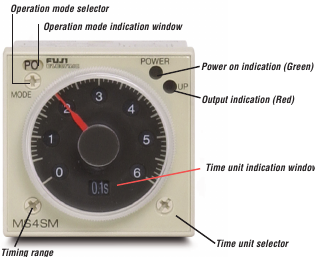
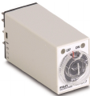
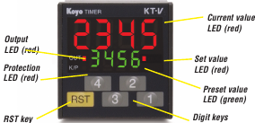

<!-- bbox: [105,84,810,66] -->
모든 애플리케이션용 타이머
<!-- bbox_blk_end -->

<!-- bbox: [105,180,390,105] -->
후지 멀티 모드 타이머, 완전한 기능
사용 편의성: 시간 범위가 조정될 때마다 해당 디스플레이가 변경됩니다.
완전한 기능: 나사 한 번 돌리기로 최대 네 가지 출력 모드를 선택할 수 있습니다. 모든 출력에는 5A, DPDT 릴레이가 포함됩니다.
LED 표시등
<!-- bbox_blk_end -->

<!-- bbox: [105,170,809,184] -->
미니어처 DIN 타이머는 작고 정확합니다
작은 크기: 1인치 미만.
사용 편의성: 간단한 다이얼로 운영자가 쉽게 설정할 수 있습니다.
정확성: 타이머는 설정의 +/- 1%의 반복 가능한 정확도로 타이밍 기능을 수행합니다.
<!-- bbox_blk_end -->

<!-- bbox: [525,210,390,135] -->
코요 디지털 타이머: 강력하지만 사용하기 쉽습니다
이 전기식 타이머는 모든 기능을 갖추고 있으며, 완전 프로그래밍 가능:
타이밍 범위 및 모드: 초에서 시간까지의 범위와 소수 선택 및 상하 타이밍 모드로 다양한 애플리케이션을 지원합니다.
출력 모드: 5가지 출력 모드, on-delay에서 one-shot까지, 신뢰할 수 있는 2A 릴레이를 사용하여 제어 장치를 작동합니다.
방해 방지: 개별 키에 대해 키 보호를 설정하여 운영자의 실수로 인한 변경을 방지할 수 있습니다.
<!-- bbox_blk_end -->

<!-- bbox: [105,383,810,387] -->
<table>
  <tr>
    <th></th>
    <th>ST7P 시리즈</th>
    <th>MS4S 시리즈</th>
    <th>KT-V4S 시리즈</th>
  </tr>
  <tr>
    <th>디스플레이</th>
    <td>수동 다이얼
시간 설정
출력 LED 표시등</td>
    <td>수동 다이얼
시간 설정
전원 LED 표시등
출력 LED 표시등
출력 모드 설정</td>
    <td>시간 설정을 위한 4자리 녹색 LED 디스플레이
현재 시간을 위한 4자리 빨간색 LED 디스플레이
출력 LED 표시등
프로그래밍 표시등</td>
  </tr>
  <tr>
    <th>입력 전원</th>
    <td>100-120 VAC 또는 24 VDC</td>
    <td>100-240 VAC 또는 24 VDC/AC</td>
    <td>85-260 VAC 또는 10-26 VDC</td>
  </tr>
  <tr>
    <th>입력</th>
    <td>타이밍 신호</td>
    <td>리셋 신호
시작 신호
게이트 신호
타이밍 신호</td>
    <td>시작 신호
리셋 신호
타이밍 신호</td>
  </tr>
  <tr>
    <th>출력</th>
    <td>정상 개방 DPDT
정상 닫힘 DPDT</td>
    <td>정상 개방 DPDT
정상 닫힘 DPDT</td>
    <td>1 SPDT
DC NPN 트랜지스터</td>
  </tr>
  <tr>
    <th>접촉 등급</th>
    <td>3 A @ 240 VAC (저항성 부하)</td>
    <td>5 A @ 250 VAC (저항성 부하)</td>
    <td>기계적: 2 A @ 220 VAC
트랜지스터: 100 mA @ 24 VDC</td>
  </tr>
  <tr>
    <th>출력 모드</th>
    <td>on-delay</td>
    <td>on-delay
깜빡임
one shot
off-delay</td>
    <td>on-delay
깜빡임
one shot
off-delay
누적</td>
  </tr>
  <tr>
    <th>시간 범위</th>
    <td>0.4초에서 60분</td>
    <td>0.05초에서 60시간</td>
    <td>0.001초에서 999.9시간</td>
  </tr>
  <tr>
    <th>케이스 등급</th>
    <td>NEMA 1</td>
    <td>NEMA 1</td>
    <td>IP65 - 패널</td>
  </tr>
  <tr>
    <th>기관 승인</th>
    <td>UL/CSA/CE/TUV</td>
    <td>UL/CSA/CE/TUV</td>
    <td>UL/CSA/CE</td>
  </tr>
  <tr>
    <th>가격</th>
    <td>40.00부터 시작</td>
    <td>49.50부터 시작</td>
    <td>102.00부터 시작</td>
  </tr>
</table>
<!-- bbox_blk_end -->

<!-- bbox: [105,799,842,132] -->

<!-- bbox_blk_end -->
