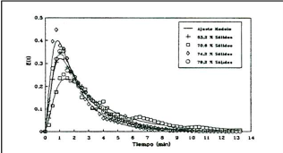

<!-- bbox: [105,95,390,29] -->
운영 조건이 정의된 후, 각 시험에서 수행된 측정은 다음과 같습니다:
<!-- bbox_blk_end -->

<!-- bbox: [105,134,404,86] -->
- 밀의 내부 로드의 채움 수준
- 내부 로드의 습윤 및 건조 질량
- 내부 로드의 습윤 및 건조 부피
- 내부 로드의 입도
- 밀의 배출 입도
- 밀의 전력 소비량
<!-- bbox_blk_end -->

<!-- bbox: [105,230,390,200] -->
각 시험은 이전 평가에서 얻은 내부 로드로 시작되었으며, 이는 밀의 안정화 시간을 줄이기 위한 목적이었습니다. 대부분의 시험에서, 밀은 표준 조건에서 작동을 시작했으며, 작동이 안정화된 후에 계획된 변수를 변경했습니다. 시스템이 다시 안정화된 후, 밀의 배출 샘플을 수집하고 전력 소비를 기록했습니다. 이 기간 동안, 유체의 주류 시간 분포를 결정하기 위한 작업이 이루어졌습니다. 각 시험의 끝에서, 광물 및 물의 공급 흐름을 동시에 차단하여 밀의 채움 수준을 직접 측정하기 위해 밀을 멈추었습니다. 밀의 내용물은 가중치와 습윤 부피를 결정하기 위해 드럼으로 배출되었으며, 건조된 후 다시 가중치를 통해 입도 분포를 결정했습니다. 내부 로드에 포함된 물의 정확한 얻기에는 가장 큰 어려움이 있었으며, 또한 미세 입자들의 완전한 수집도 어렵게 나타났습니다.
<!-- bbox_blk_end -->

<!-- bbox: [525,84,390,143] -->
밀이 연구 중인 운영 조건에서 안정화된 후, 배출의 입도 및 고체 백분율 특성을 평가하기 위한 샘플링은 1시간 동안 10분 간격으로 이루어졌습니다. 한편, 샘플링 기간 동안 4개의 공급 드럼이 임의로 선택되었으며, 이들로부터 두 개의 샘플이 입도 특성을 위해 수집되었습니다. 동시에, 각 시험에서, 밀 내 물의 주류 시간 분포(DTR)를 결정하기 위해 나트륨 클로라이드를 추적제로 사용했습니다. 추적제의 회수된 배출량은 물의 전도도 측정을 통해 측정되었습니다. 이를 위해 다음 시간 간격에서 30개의 배출 샘플을 수집했습니다:
<!-- bbox_blk_end -->

<!-- bbox: [525,237,404,71] -->
- 2개의 샘플: 펄스 추가 전
- 10개의 샘플: 0~90초, 10초 간격
- 6개의 샘플: 110~210초, 20초 간격
- 4개의 샘플: 240~330초, 30초 간격
- 8개의 샘플: 390~810초, 60초 간격
<!-- bbox_blk_end -->

<!-- bbox: [525,319,390,15] -->
**실험 결과**
<!-- bbox_blk_end -->

<!-- bbox: [525,345,404,86] -->
- 결과의 재현성재현 시험에서의 용량, 채움 수준 및 전력 소비량 결과는 표 2에 표시되어 있습니다. 여기서, 수행된 시험에서 얻어진 결과의 재현성 정도가 매우 높다는 것을 알 수 있으며, 특히 특정 에너지 소비량에서 이러한 특성이 두드러지며, 각 시험 그룹에서의 변동 범위가 작습니다.
<!-- bbox_blk_end -->

<!-- bbox: [105,469,812,193] -->
<table>
  <tr>
    <th>번호</th>
    <th>4" + 1/2" 입도 분포 (%)</th>
    <th>전력 (kW)</th>
    <th>특정 에너지 (kWh/t)</th>
    <th>채움 수준 (%)</th>
  </tr>
  <tr>
    <td>1</td>
    <td>10.5</td>
    <td>78.6</td>
    <td>3.09</td>
    <td>25.9</td>
  </tr>
  <tr>
    <td>2</td>
    <td>10.4</td>
    <td>11.7</td>
    <td>7.79</td>
    <td>9.36</td>
    <td>2.71</td>
    <td>18.2</td>
  </tr>
  <tr>
    <td>13</td>
    <td>12.6</td>
    <td>9.2</td>
    <td>78.2</td>
    <td>9.15</td>
    <td>2.64</td>
    <td>18.6</td>
  </tr>
  <tr>
    <td>14</td>
    <td>15.7</td>
    <td>5.9</td>
    <td>78.1</td>
    <td>8.89</td>
    <td>2.55</td>
    <td>18.7</td>
  </tr>
  <tr>
    <td>4</td>
    <td>13.2</td>
    <td>11.1</td>
    <td>75.9</td>
    <td>8.44</td>
    <td>2.47</td>
    <td>17.5</td>
  </tr>
  <tr>
    <td>15</td>
    <td>15.7</td>
    <td>11.7</td>
    <td>78.4</td>
    <td>8.69</td>
    <td>2.42</td>
    <td>17.1</td>
  </tr>
  <tr>
    <td>16</td>
    <td>16.1</td>
    <td>6.5</td>
    <td>77.4</td>
    <td>8.91</td>
    <td>2.46</td>
    <td>22.7</td>
  </tr>
</table>
<!-- bbox_blk_end -->

<!-- bbox: [105,690,812,38] -->
**표 2.** 반복 시험에서 얻어진 결과 비교.
<!-- bbox_blk_end -->

<!-- bbox: [105,766,404,185] -->
- 밀의 혼합 모드 결정그림 2은 밀의 공급 물에 추적제 펄스를 추가한 후 DTR 측정 결과를 보여줍니다. 이 시험에서 배출의 고체 백분율이 변화되었습니다. 이 경우, 주류 시간 분포의 기본 개념은 적용되지 않으며, 이는 큰 크기의 입자 파괴가 주된 메커니즘인 시스템이기 때문입니다. 따라서, 이 결과는 밀을 통해 펄프의 혼합 정도만을 나타냅니다. 이 그림에서 DTR 곡선이 배출의 고체 백분율에 따라 대략적인 범위를 보여줍니다. 일반적으로 혼합 모드는 완벽한 혼합 조건(음의 지수 감쇠)에서 크게 벗어나지 않는다는 것을 알 수 있습니다. 이는 매우 중요하며, 이전에 제시된 단순화된 모델의 근사치 중 하나를 구성합니다.
<!-- bbox_blk_end -->

<!-- bbox: [525,756,390,113] -->

**그림 2.** 밀의 배출에서 고체 백분율이 다른 밀 반자동 시험용 밀의 DTR 곡선 및 완벽한 혼합 모델 조정.
<!-- bbox_blk_end -->

<!-- bbox: [525,880,404,43] -->
- 공급 흐름의 효과공급, 내부 로드 및 밀의 제품에 대한 실험 입도는 공급 흐름을 변수로 연구한 시험에서 그림 3, 4 및 5에 표시되어 있습니다.
<!-- bbox_blk_end -->
